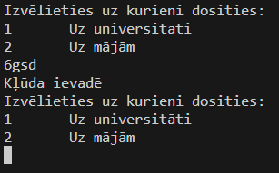
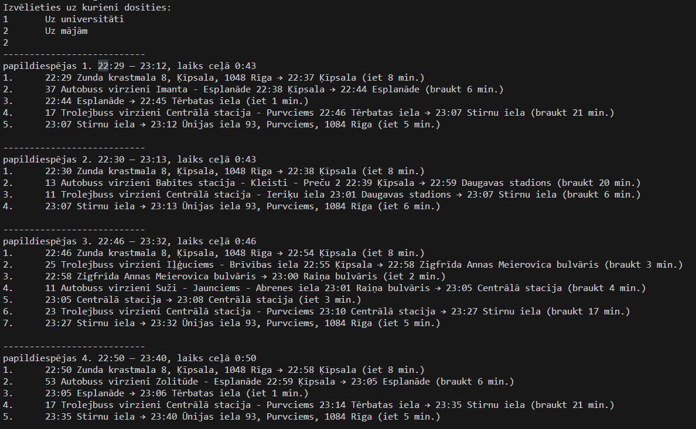

## Kursa darbs priekšmetā "Lietojumprogrammatūras automatizēšanas rīki"
### Projekta uzdevums
Studentam, katru dienu ir jāmēro ceļš līdz universitātei un atpakaļ, un reizēm ceļš līdz universitātei varētu būt sarežģītāks par iekāpšanu vienā sabiedriskajā transportlīdzeklī. Šīs problēmas atrisināšanai ir maršruta plānotāji, kas palīdz atrast izdevīgāko maršrutu ar pārsēšanos dažādos sabiedriskaijos transportos, lai pēc iespējas ātrāk vai efektīvāk nonāktu galapunktā. 

Tā kā galapunkti ļoti bieži ir nemainīgi *(no mājām uz universitāti vai no universitātes uz mājām)*, atšķiras tikai izbraukšanas laiki, jo ne katru dienu un katru nedēļu lekciju laiki sakrīt, lai atcerētos visu sabiedrisko transportu attiešanas laikus, tāpēc efektīvākā maršruta atrašanu var automatizēt reālajā laikā, lai iegūtu labāko maršrutu laikā, kad ir jāizbrauc.

Uzdevums ir iegūt dotajā momentā maršruta plānus no punkta A līdz punktam B, kas pārsvarā ir nemainīgi, atšķiras tikai laiks un virziens.

Izveidotā `Python` programmatūra skrāpē ***Rīgas Satiksmes maršruta plānotāja*** rīku, ievadot tajā iepriekš nodefinētas sākumpunkta un galapunkta adreses un nolasot izveidotos maršrutus, lietotājam jaizvēlas tikai galamērķis.

---
### Izmantotās `Python` bibliotēkas
`Selenium` - Galvenā bibliotēka, jo tā tiek izmantota tīmekļa skrāpēšanai ievadot un iegūstot attiecīgos datus;<br>
`BeautifulSoup4` - Nepieciešama `HTML` koda apstrādei un informācijas iegūšanai no tā;<br>
`time` - modulis, kas ļauj izmantot dažādas ar laiku saistītas funkcijas;<br>
`re` - *Regular Expression operations* modulis, kas ļauj teksta *(simbolu virkņu)* manipulēšanu un vieglāku apstrādi.

---
### Programmatūra 

Programmatūrā sākotnēji ir nodefinētas galapunktu *(mājas un universitātes)* adreses:

```Python
home_address="Ūnijas iela 93"
faculty_address="Zunda krastmala 8"
```
Darbinot programmu, lietotājam tiek iedota izvēle uz kurieni doties *(virziens)*, un lietotājs ievada savu vēlamo galapunktu, gadījumā, ja tiek ievadīts nederīgs simbols, tiek izvadīts kļūdas paziņojums, un lietotājam vēlreiz jāievada sava izvēle:<br>
<br>

Pie pareizas ievades, *Rīgas Satiksmes maršruta plānotājā* tiek ievadīts sākumpunkts un galapunkts pēc lietotāja izvēles:

```Python
# Sākumpunkta ievade
find = wait.until(ec.presence_of_element_located((By.ID, "inputStart")))
find.click()
find.send_keys(start)

# ...

# Galapunkta ievade
find = driver.find_element(By.ID, "inputFinish")
find.click()
find.send_keys(end)
```

Lai iegūtu nepieciešamo informāciju, jāapiet *Rīgas satiksmes maršruta plānotāja* uzbūve, kur daļa elementu atjauninās atkarībā no lietotāja ievades meklētāju laukos vai arī ir slēpti. Lai ievadītā punktu informācija tiktu saglabāta un izmantota, ir nepieciešams uzklikšķināt uz maršruta plānotāja rīka piedāvātajā nolaižamajā izvēlnē attiecīgā adrese:

```Python
wait = WebDriverWait(driver, delay)

# ...

wait.until(ec.visibility_of_element_located((By.XPATH, f"//*[contains(text(), '{start[:4]}')]")))
find = driver.find_element(By.ID, "geocaching-results")
find = find.find_element(By.XPATH, ".//a")
find.click()
```

Pēc adrešu ievades tiek izvilkta informācija par piedāvātajiem maršrutiem. Vieglākai informācijas iegūšanai tiek nolasīts viss `HTML` kods, kurā tā ir atrodama, un tas tiek apstrādāts, lai lietotājs spētu vienkārši saprast informāciju. Šī darbība ir nepieciešama, jo maršruta plānotājs izmanto dinamiskus un slēptus elementus, kuru vērtības `Selenium` nevar nolasīt, bet var nolasīt visu `HTML`, kur tās ir ierakstītas.

```Python
# Maršruta detaļu (sīkākas informācijas) iegūšana un tīrīšana
route_details = find.find_elements(By.CLASS_NAME, "RouteDetails")
route_list = []
for route in route_details:
    inner_html = route.get_attribute('innerHTML')
    text = bs4(inner_html, 'html.parser').get_text(separator=' ', strip=True)
    cleaned_text = text.replace('\xa0', ' ')
    route_list.append(cleaned_text)

# Teksta sadale formatēšanai
route_detail_list = [re.split(r'(?<=min\.\))', route) for route in route_list]
```

Visi maršruti ir saglabāti sarakstā *(list)* un tiek izvadīti lietotājam ērtā un pārskatāmā veidā. Ja netika atrasts neviens maršruts tiek izvadīts kļūdas paziņojums:

```Python
# Teksta izvade
for i in range(len(options_list)):
    print(f"---------------------------\n{options_list[i]}")
    for j in range(len(route_detail_list[i])-1):
        print(f"{j+1}.\t{route_detail_list[i][j].lstrip()}")
    print()

if options_list == []:
    print("Netika atrasts neviens maršruts")
```
